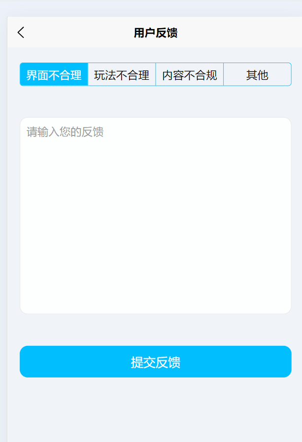

# 界面如下：

## 2024-07-12 购物订单页面

## 2024-07-12 打卡页面，折叠列表加上图标

## 2024-07-11 打卡记录页面

## 2024-07-11 足迹页面、个人主页、社区搜索框

    
    
    

## 2024-07-11 反馈页面

## 2024-07-11 足迹页面-时间轴

## 2024-07-10 商店、排行榜

## 2024-07-09 总体展示

